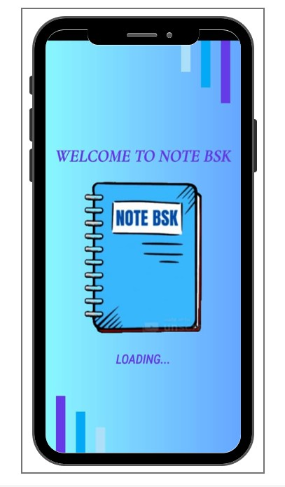
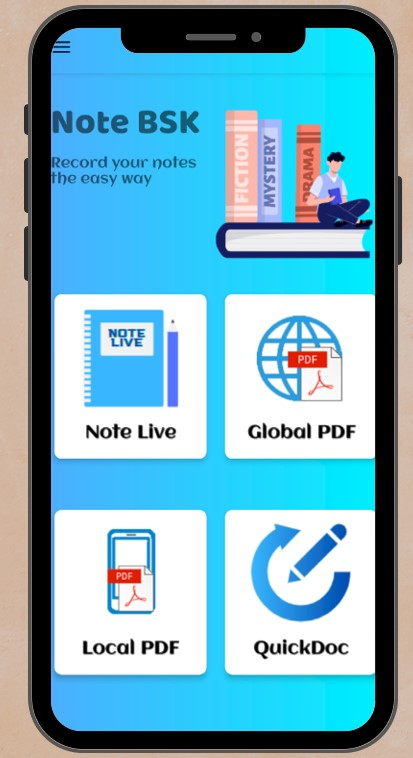
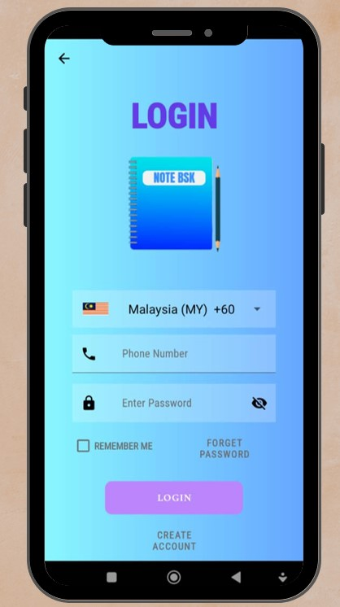
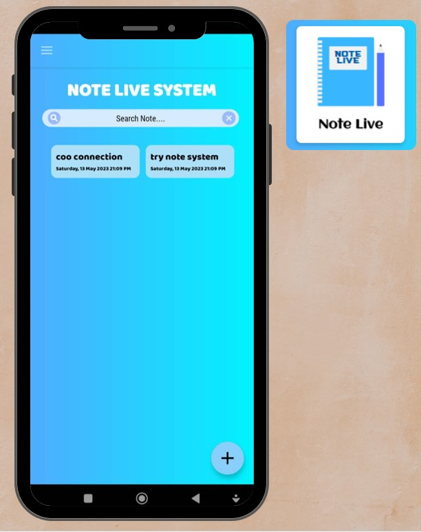
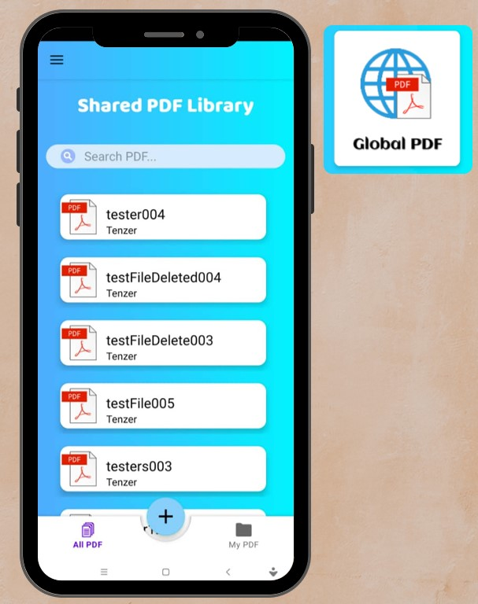

# 📱 E-Note System Mobile Application

## 📌 Overview

E-Note System is a mobile note-taking application developed using Android Studio.
It allows users to create, edit, and manage notes easily, as well as handle PDF documents efficiently.

---

## 🚀 Features

* Create and manage notes (Note Live)
* Access shared PDF library (Global PDF)
* Upload and view local PDF files
* Quick document editing (QuickDoc)
* User login and registration
* Feedback system
* Settings management

---

## 🛠️ Tools Used

* Android Studio
* Java
* XML

---

## 📸 Screenshots

---

## 🎯 Purpose

This project was developed during practical training at POLIMAS to demonstrate mobile application development and user interface design.
